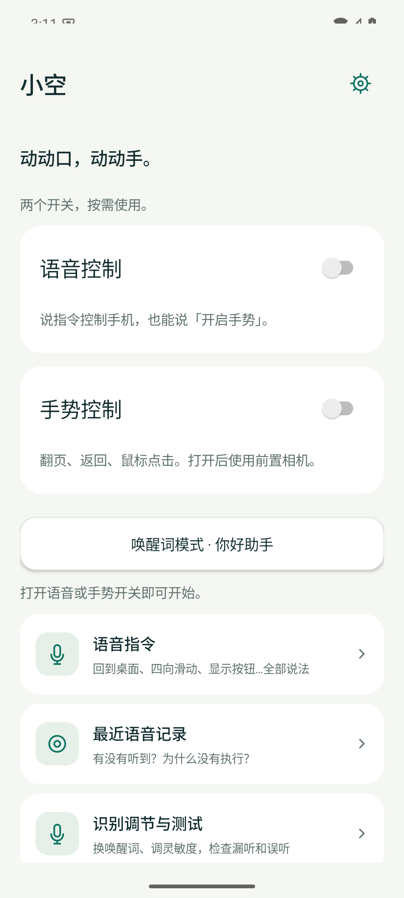
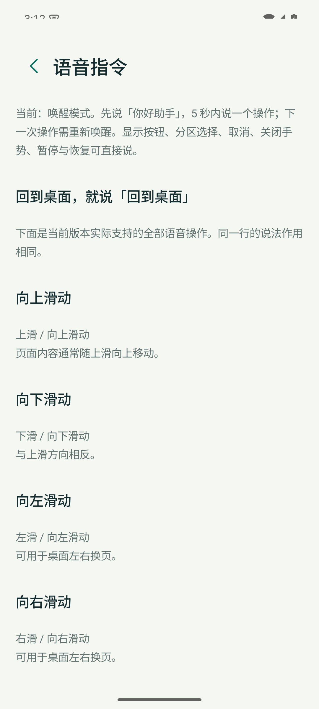

# 小空 XiaoKong

**用中文语音和单手手势操作 Android，让触屏之外多一种选择。**

[English](README.en.md) · [下载社区预览版](https://github.com/MichealMin928/xiaokong/releases) · [快速开始](docs/public/GETTING_STARTED.md) · [反馈问题](https://github.com/MichealMin928/xiaokong/issues/new/choose) · [参与贡献](CONTRIBUTING.md)

小空是一个 Android 原生免触控交互项目：离线中文语音、前置摄像头手势、隔空鼠标和系统无障碍操作。我们希望和使用者、Android 开发者、语音及视觉研究者一起，减少漏识别、误触和操作等待。

**当前为 0.6.1-rc2 社区预览版。** 项目来自真实设备上的连续迭代，仍有识别可靠性、跨设备适配和长期耗电问题需要共同验证。它尚不是成熟的辅助设备，也没有“所有 App 都能控制”的保证。

## 可以做什么

| 功能 | 当前行为 |
| --- | --- |
| 中文语音 | 安静环境直接说“上滑”“返回”“回到桌面”；也可选择先唤醒再发指令 |
| 按钮编号 | 说“显示按钮”，给当前页面的可点击控件标号，再说“一号”等 |
| 单手翻页 | 四指朝上、向上移；食指和中指朝上、向下移；不同手形区分左右换页 |
| 隔空鼠标 | 单独伸食指瞄准，拇指向食指靠近两次点击，不要求指尖接触 |
| 系统操作 | 返回、桌面、最近任务，以及已获得权限的跨应用滑动、点击 |
| 本机诊断 | 固定指令处理记录、识别设置、反馈导出、主动动作采集与回放 |
| 实验功能 | RGB 前摄眼控阅读、拖动及应用模式设置，需要单独校准和验证 |

完整口令和手势见[操作指南](docs/public/GETTING_STARTED.md)。首页保留语音、手势两个开关；只用语音时可关闭摄像头。

## 先试用

1. 在 [Releases](https://github.com/MichealMin928/xiaokong/releases) 下载 `arm64` 社区预览 APK。最低 Android 8；首发安装包面向 64 位 ARM 手机。
2. 按 App 引导按需开启麦克风、悬浮窗、无障碍；使用手势时再开启相机。部分 Android 系统需要在应用信息中允许受限设置。
3. 先在安静环境开启语音，说“回到桌面”，再试“显示按钮”和编号；测试手势前阅读[手势表](docs/public/GETTING_STARTED.md#手势)。
4. 用[设备测试模板](https://github.com/MichealMin928/xiaokong/issues/new?template=device-report.yml)反馈成功和失败情况。不会写代码也能参与。

社区 APK 使用独立发布签名，不能直接覆盖此前用 debug 签名安装的内部测试包。已有本机记录的用户请先导出，详见[安装说明](docs/public/GETTING_STARTED.md#安装与升级)。

## 隐私和边界

- App 不申请联网权限；声音与图像在设备内处理，不保存原始录音或摄像头视频。
- 你主动采集的手部关键点、反馈说明和固定指令历史保存在本机；分享前请自行检查。公开仓库不包含内部真人采集记录。
- 按钮编号依赖 Android 无障碍控件。画布、游戏、部分视频区域和受保护页面可能没有可用按钮，不会用空格子冒充控件。
- 视频外放、口音、噪声、光照、遮挡和机型都会影响识别。误触、漏听、鼠标连续性和长时间耗电仍是重点改进项。
- 社区入口由外部浏览器打开，需要网络。App 不会自动把反馈上传到 GitHub。

详见[隐私说明](PRIVACY.md)、[已知问题与路线图](docs/public/ROADMAP.md)。

## 界面预览

以下为 Android 15 模拟器上的实际 Release 界面，仅展示操作入口，不代表真人语音或手势验收。

<p>
  
  
</p>

## 从源码构建

需要 JDK 17 或 21、Python 3.10+、Android SDK Platform 36 / Build Tools 35.0.0。Gradle Wrapper 已随仓库提供。

```bash
git clone https://github.com/MichealMin928/xiaokong.git
cd xiaokong
# 将 ANDROID_HOME 指向已安装的 Android SDK，或通过 Android Studio 配置 local.properties。
# 先阅读 THIRD_PARTY_NOTICES.md：模型不全部适用项目代码的 Apache-2.0。
python3 scripts/fetch-artifacts.py --accept-model-licenses
python3 scripts/fetch-artifacts.py --check
./gradlew -PtargetAbi=arm64-v8a :app:testDebugUnitTest :app:lintDebug :app:assembleDebug
```

APK 位于 `app/build/outputs/apk/debug/app-debug.apk`。首次构建需要联网下载依赖，安装后的识别在本机运行。不传 `targetAbi` 可构建多架构版本。模型和 AAR 从上游下载，下载包及提取文件均校验 SHA-256；不需要 API Key。

[完整构建与发布说明](docs/public/BUILDING.md) · [架构导航](docs/public/ARCHITECTURE.md) · [测试方法](docs/public/TESTING.md)

## 一起参与

- **使用者**：提交机型、Android 版本、环境、复现步骤及实际结果；请同时报告失败，不只报告成功。
- **开发者**：从 [`good first issue`](https://github.com/MichealMin928/xiaokong/labels/good%20first%20issue) 开始；先读 [CONTRIBUTING.md](CONTRIBUTING.md)，提交小而可验证的 PR。
- **语音和视觉研究者**：帮助改善短口令、背景音、鼠标连续性；改动需同时评估误触和漏识别，不能只降低阈值。
- **文档与无障碍体验参与者**：改进指引、可读性、TalkBack 和多语言说明。

项目由 [@MichealMin928](https://github.com/MichealMin928) 维护。公共沟通使用 [Issues](https://github.com/MichealMin928/xiaokong/issues) 和 [Discussions](https://github.com/MichealMin928/xiaokong/discussions)，安全问题使用[私密报告渠道](SECURITY.md)。不要求捐赠、购买订阅或提供个人录音。

## 许可与致谢

项目自有代码和文档采用 [Apache-2.0](LICENSE)。MediaPipe、CameraX、sherpa-onnx、ONNX Runtime、Silero VAD、SenseVoiceSmall 及其他依赖遵循各自许可；尤其 SenseVoiceSmall 使用独立的 FunASR 模型条款，不能将整个 APK 的所有内容统一重许可为 Apache-2.0。详见 [NOTICE](NOTICE) 和 [THIRD_PARTY_NOTICES.md](THIRD_PARTY_NOTICES.md)。

本项目与 Google、OpenAI、OPPO、阿里巴巴及其他提到的组织无隶属或背书关系。
