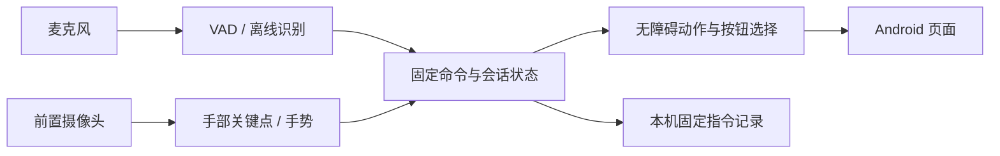

# 架构导航

主程序位于 `app/src/main/java/com/airgesture/app`，使用 Kotlin、Android 原生视图和前台服务。

| 目录 | 职责 |
| --- | --- |
| `voice/` | 音频采集、唤醒、VAD、离线短句识别、固定口令和处理历史 |
| `camera/`, `vision/` | CameraX、MediaPipe 手部跟踪与帧节流 |
| `gesture/`, `cursor/` | 手形互斥、时序动作、瞄准锁定、光标平滑 |
| `command/`, `session/` | 统一命令、语音/手势开关、控制会话状态 |
| `accessibility/`, `selection/` | 系统动作、按钮扫描、编号和点击前复核 |
| `service/`, `mode/` | 前台生命周期、应用模式、温控和空闲策略 |
| `eye/`, `training/` | 实验眼控、主动关键点采集和回放 |
| `feedback/`, `debug/` | 本机反馈、运行指标及诊断 |

安静直接模式先判断说话边界，再调用 SenseVoiceSmall int8，并严格匹配有限指令及完整读音。唤醒模式使用小型 KWS 路径。编号依赖真实无障碍节点，不做屏幕 OCR。

手势与语音开关分别控制资源；只开语音时不需要手部模型。相机采用 KEEP_ONLY_LATEST，识别限制在途帧，温度/空闲状态降低处理频率。实际省电表现取决于机型，见测试说明。

任何控制改动都要检查四层：采集有效 → 识别命令 → 系统接受动作 → 用户页面改变。最后一层无法仅靠识别日志或 JVM 测试证明。
